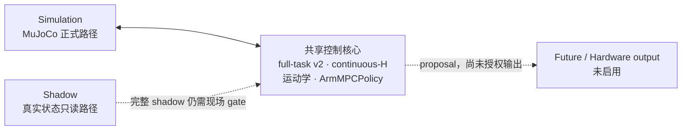
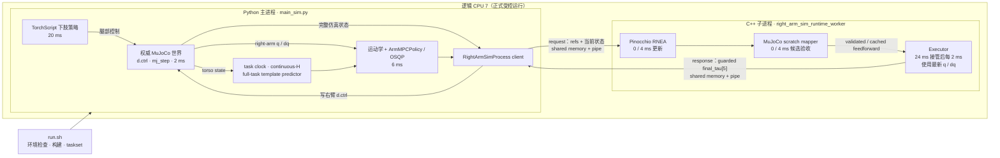
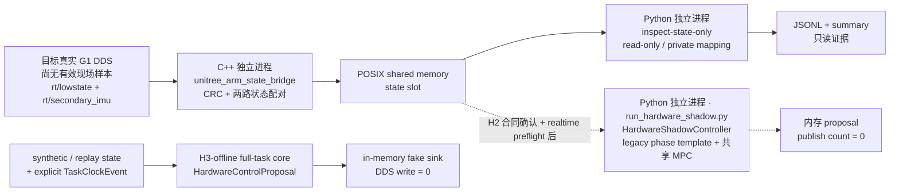
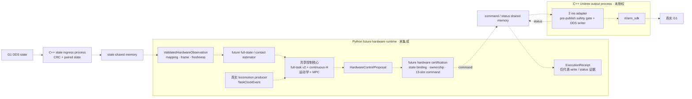

# 运行时架构：从 MuJoCo 到真实 G1

这是一张“运行时地图”，用于在几分钟内看懂程序实际怎样启动、哪些模块属于
独立进程，以及上真机时哪些部分会替换。算法、协议和安全门的详细设计不在这里
重复，见文末链接。

当前状态只有三句话：

- **Simulation** 是当前正式、已验证的控制路径；
- **Shadow** 只允许读取真实 G1 状态，当前仍缺真实机器人证据；
- **Future / Hardware output** 只有接口和离线准备，未授权、未启用。

图中实线表示当前已有的调用或数据路径，虚线表示现场 gate 之后或未来才允许接通
的路径。

## 一分钟总览

“共享控制核心”是逻辑边界，不代表一个单独进程。full-task predictor、continuous-H
和 MPC 的逐 anchor 编排由
[`FullTaskRightArmControlCore`](right_arm_runtime/full_task_control_core.py) 保留一份；
Simulation 与 H3-offline shadow 只提供各自已验证的状态、权威 `TaskClockEvent` 和
平台运动学 helper，不各维护一套近似时钟或 MPC。

## Simulation：当前正式运行结构

这里有两个独立 OS 进程：Python 主进程和它启动的 C++ worker。Python 经
`taskset` 固定到 CPU 7，worker 继承同一 affinity。Python 拥有唯一的仿真时间和
物理世界，必须等 worker 返回通过当前执行链 guard 的 `final_tau`，写入 `d.ctrl`
后才调用 `mj_step()`。因此当前正式 MuJoCo 是 blocking lockstep，不是并行流水线
或 free-running simulator。

还要注意：

- MPC QP 在 Python 主进程；C++ worker 在 0/4 ms 更新 RNEA 与 MuJoCo 候选验收，
  接管后 executor 每 2 ms 用已验收/缓存的 feedforward 和最新 `q/dq` 运行；
- worker 内的 MuJoCo 是验收用 scratch model，不推进权威机器人状态；
- task/template/H 从 `t=0` 推进；右臂在 `[0, 24 ms)` 使用固定姿态 PD，24 ms 的
  anchor 4 才交给 MPC；
- `RightArmSimProcess`、MuJoCo mapper、`d.ctrl` 和 `mj_step()` 都属于
  **simulation adapter**，不是可直接搬到真机的控制核心。

入口与边界代码：[`run.sh`](run.sh)、[`main_sim.py`](main_sim.py)、
[`right_arm_runtime/sim_process.py`](right_arm_runtime/sim_process.py)、
[`cpp/right_arm_sim_runtime/`](cpp/right_arm_sim_runtime/)。

## Shadow：真实状态进入仓库，但不输出命令

当前批准入口是
[`tools/realtime/run_hardware_state_inspection.sh`](tools/realtime/run_hardware_state_inspection.sh)：
C++ bridge 只有 subscriber，没有 `LowCmd` 或 command publisher；Python 以只读映射
检查并记录状态。机器人目前不在现场，所以 H1 仍是 **PARTIAL**，不能把离线测试
写成真实 G1 验证。

正式现场 launcher 的 verification flags 会在连接 DDS 前 fail closed；它目前仍只
开放 legacy phase-template 兼容模式。另有一条已经通过离线测试的 H3-offline 路径：
synthetic/replay state 与显式 `TaskClockEvent` 进入共享 full-task core，覆盖
continuous-H、24 ms anchor 4 handoff 和完整 `[0,8.06)` proposal replay。该路径只把
`HardwareControlProposal` 交给内存 fake sink，`arm_weight=0`、publish/write count
始终为 0；它不是真实 G1 shadow session，也不证明 hardware torque state 完整。
两条 shadow 路径都不使用 Simulation 的 `RightArmSimProcess`、C++ simulation
worker 或 MuJoCo mapper。

入口与边界代码：[`tools/realtime/run_hardware_shadow.sh`](tools/realtime/run_hardware_shadow.sh)、
[`run_hardware_shadow.py`](run_hardware_shadow.py)、
[`right_arm_runtime/hardware_shadow.py`](right_arm_runtime/hardware_shadow.py)、
[`right_arm_runtime/unitree_shm.py`](right_arm_runtime/unitree_shm.py)、
[`cpp/unitree_arm_adapter/src/state_bridge_main.cpp`](cpp/unitree_arm_adapter/src/state_bridge_main.cpp)。

## Future / Hardware：目标方向，当前未接通

仓库已有离线 proposal/command/receipt 合同、fake sink，以及一个 output-capable
C++ adapter 原型，但没有正式 launcher 把 full-task v2 proposal 接到真实 DDS
输出。整张图是目标方向，虚线不能理解为已完成或已获授权的真机链路。未来 Python
runtime 与 C++ 2 ms output process 通过 command/status shared memory 隔离；C++
侧仍必须在 publish 前独立检查 freshness、deadline、温度、限幅和输出许可。
`ExecutionReceipt` 只能证明 writer/status 路径，不能证明实体电机精确执行了力矩。

上真机时，边界应保持如下：

| 继续保留的一份共享控制核心 | 由 Hardware adapter 替换或新增 |
| --- | --- |
| full-task protocol、绝对 task time、continuous-H | MuJoCo state、`d.ctrl`、`mj_step()` |
| full-task template v2 与 predictor | `RightArmSimProcess`、simulation C++ worker |
| 运动学/模型后端接口、`ArmMPCPolicy` | MuJoCo DDQ-to-torque mapper 与仿真认证 |
| 右臂关节定义、`HardwareControlProposal` 接口 | G1 motor index/sign、状态/接触估计、真实 task epoch |
| 控制意图和 fail-closed 原则 | 13-slot command、hardware torque 合同、ownership、watchdog、急停和 receipt |

MuJoCo 的 `max_abs_qacc=10 rad/s²` 不能默认照搬成真机 hard-stop；真机必须根据硬件
证据分别定义 hard-stop、soft guard 和 diagnostics。

## 当前验证边界

| 路径 | 当前状态 |
| --- | --- |
| Simulation：full-task v2 + continuous-H + 24 ms handoff + process | **simulation-validated**；仅限冻结模型、任务和受控运行环境 |
| H1 state inspection | 代码与离线合同已就绪；无真实 G1 样本，**PARTIAL** |
| 完整只读 shadow | H3-offline full-task proposal replay 已通过，fake sink write/publish 均为0；真实 G1 launcher 仍受现场配置 gate 阻止且保持 legacy 兼容，**hardware-unverified** |
| Future hardware output | 合同/测试/fake sink 和 C++ 原型；**未集成、未授权、hardware-unverified** |

## 架构与代码同步约定

`ARCHITECTURE.md` 是本仓库的运行时架构基准。以下任一变化都必须在**同一次代码
变更**中同步更新这里的图和状态说明：

- 启动入口、独立进程/worker 数量或 CPU/生命周期关系；
- IPC、状态来源、控制命令方向或谁拥有权威时间/物理状态；
- shared control core 与 Simulation/Shadow/Hardware adapter 的边界；
- 某条路径从 disabled、read-only 或 site-gated 变为可执行。

反过来，文档中的目标架构只有在对应代码、测试和验证 gate 落地后，才能从虚线
改成实线。评审运行结构相关改动时，至少同时核对实际 launcher、进程创建代码、
IPC 协议和输出许可；仅修改图或仅修改代码都视为未完成。

## 详细设计从哪里继续读

- 固定任务、模板与 H：[`FULL_TASK_TEMPLATE.md`](FULL_TASK_TEMPLATE.md)
- MPC 数学：[`MPC_DESIGN.md`](MPC_DESIGN.md)
- Simulation process 与计时：[`REALTIME_RUNTIME.md`](REALTIME_RUNTIME.md)、
  [`right_arm_runtime/README.md`](right_arm_runtime/README.md)
- Shadow 操作边界：[`HARDWARE_SHADOW.md`](HARDWARE_SHADOW.md)
- 真机接口和阶段 gate：[`HARDWARE_INTEGRATION_PLAN.md`](HARDWARE_INTEGRATION_PLAN.md)
- 离线准备和现场待验项：[`HARDWARE_OFFLINE_PREPARATION.md`](HARDWARE_OFFLINE_PREPARATION.md)
