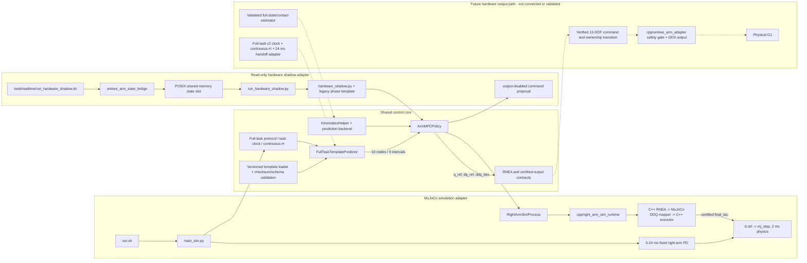

# 控制核心与平台适配器边界

本文描述当前冻结方案的工程边界。最终仿真方案只有一份右臂 MPC 和一份
full-task predictor 实现；MuJoCo 与 Unitree 负责提供不同的平台状态和输出
接口，不各自复制控制算法。

当前正式结果是受控 MuJoCo 仿真结果。hardware shadow 仍是只读、
hardware-unverified 的 legacy phase-template 兼容路径；它尚未接入
full-task template v2、continuous-H 的正式任务时钟或 24 ms startup-PD
handoff。

## 总体数据流



虚线表示尚未完成的真机主动输出路径，不是当前可执行的控制链。

## Shared control core

Shared control core 是逻辑边界，目前并未为了目录形式而搬成一个大型新包。
下列代码由平台适配器复用，算法只能保留一份：

| 职责 | 当前实现 | 边界说明 |
| --- | --- | --- |
| 绝对任务时间、2/6/20 ms 网格、direct stop 和 continuous causal-H | [`disturbance_learning/full_task_protocol.py`](disturbance_learning/full_task_protocol.py) | task clock、anchor 索引和 H 更新由同一实现定义；平台不得复制近似时间逻辑。 |
| 模板资产完整性 | [`disturbance_learning/full_task_template_asset.py`](disturbance_learning/full_task_template_asset.py) | 在线只加载显式路径，并验证 SHA256、schema、protocol、shape 和 SO(3)。 |
| 扰动 horizon 接口与 full-task 查询 | [`disturbance_predictor.py`](disturbance_predictor.py) | `FullTaskTemplatePredictor` 输出 10 个 nodes 和 9 个 intervals；正常 headline 查询不循环模板。 |
| MPC 数学与 QP | [`arm_mpc.py`](arm_mpc.py) | 唯一的 `ArmMPCPolicy`；仿真和 shadow 不维护两份 MPC。 |
| 控制器装配与右臂关节定义 | [`right_arm_control_setup.py`](right_arm_control_setup.py) | `create_arm_controller` 和 `RIGHT_ARM_JOINT_NAMES` 的小型共享模块；simulation 与 hardware shadow 直接复用同一实现。 |
| 运动学、坐标变换与 `DisturbanceHorizon` | [`kinematics_helper.py`](kinematics_helper.py) | 将实测状态、节点/区间扰动和预测后端装配为 MPC 输入。 |
| 模型后端抽象与 RNEA C ABI | [`robot_model_backend/`](robot_model_backend/), [`cpp/right_arm_rnea/`](cpp/right_arm_rnea/) | 接口属于共享边界；当前完整 RNEA 执行只在仿真链集成，真机仍缺经验证的 floating-base 状态。 |
| 最终输出的 PD、限幅、超时和非有限值合同 | [`right_arm_runtime/cpp_executor.py`](right_arm_runtime/cpp_executor.py), [`cpp/right_arm_executor/`](cpp/right_arm_executor/) | 安全语义可复用；具体的 MuJoCo 候选验收不是硬件物理验收。 |
| 跨进程 seqlock 原子操作 | [`right_arm_runtime/atomic_seqlock.py`](right_arm_runtime/atomic_seqlock.py) | simulation IPC 与 Unitree shared-memory adapter 共享中立的 `libatomic` acquire/release 定义，不依赖彼此的私有协议实现。 |

正式 predictor 资产是
[`disturbance_learning/data/full_task_template_v2/20260815_162850/full_task_template.npz`](disturbance_learning/data/full_task_template_v2/20260815_162850/full_task_template.npz)，
manifest 位于同目录的
[`full_task_template_manifest.json`](disturbance_learning/data/full_task_template_v2/20260815_162850/full_task_template_manifest.json)。
它是固定绝对任务时间 baseline，提前知道 6.4 s 的停车时刻，不泛化到任意
速度、方向或未知停车时刻。

平台间两个原有的小型反向依赖已经拆除：`create_arm_controller` 和
`RIGHT_ARM_JOINT_NAMES` 由 [`right_arm_control_setup.py`](right_arm_control_setup.py)
集中提供，[`sim_support.py`](sim_support.py) 只为既有仿真调用者重导出它们；
hardware shadow 不再导入 `sim_support.py`。同样，simulation process 和
Unitree shared-memory adapter 都直接导入中立的
[`right_arm_runtime/atomic_seqlock.py`](right_arm_runtime/atomic_seqlock.py)，
simulation IPC 不再依赖 `unitree_shm.py` 的私有实现。两个 adapter 仍保留各自
独立的 payload 和生命周期。

## 正式 MuJoCo 仿真适配器

正式入口调用链为：

```text
run.sh
  -> main_sim.py
  -> RightArmSimProcess
  -> cpp/right_arm_sim_runtime/right_arm_sim_runtime_worker
  -> C++ Pinocchio RNEA
  -> C++ MuJoCo DDQ-to-torque candidate validation
  -> C++ right-arm executor
  -> certified final_tau
  -> MuJoCo d.ctrl
  -> mj_step
```

对应入口是 [`run.sh`](run.sh)、[`main_sim.py`](main_sim.py)、
[`right_arm_runtime/sim_process.py`](right_arm_runtime/sim_process.py) 和
[`cpp/right_arm_sim_runtime/`](cpp/right_arm_sim_runtime/)。
[`cpp/build_runtime.sh`](cpp/build_runtime.sh) 构建该链使用的 RNEA、executor、
DDQ mapper 和 simulation worker。

仿真适配器负责：

- 加载 MuJoCo 模型、下肢 RL walking policy 和 heading controller；
- 从 `task t=0` 发布正式前进命令，并持续推进 full-task clock、continuous-H
  和模板查询；
- 在 `[0, 0.024 s)` 对右臂执行配置中的固定姿态 PD；下肢第一份新策略动作
  仍在 20 ms 产生；
- 在 `task time = simulation time = 0.024 s` 的 6 ms anchor 4 将右臂交给
  MPC，不重置或重播 task/template/gait clock，并传递上一物理拍真实执行的
  PD 力矩；
- 在 6.4 s 直接把 planned `vx/vy` 置零，保持 heading control，全程 headline
  为 `[0, 8.0 s)`；
- 把完整 MuJoCo 状态通过 external-step IPC 交给 C++ worker，只有收到同一
  session/request/state 的认证 `final_tau` 才写入 `d.ctrl`，随后推进 2 ms
  `mj_step`。

MuJoCo DDQ-to-torque mapper 需要 `qacc_warmstart`、约束力和外力等仿真求解器
状态，见 [`cpp/ddq_torque_mapper/`](cpp/ddq_torque_mapper/)。因此
`RightArmSimProcess` 和 mapper 都是 simulation adapter，不得直接搬到真机
路径并声称完成物理验收。

## 只读 hardware shadow 适配器

当前 shadow 调用链为：

```text
tools/realtime/run_hardware_shadow.sh
  -> cpp/unitree_arm_adapter/unitree_arm_state_bridge
  -> POSIX shared-memory state slot
  -> run_hardware_shadow.py (read-only private mapping)
  -> right_arm_runtime.hardware_shadow.HardwareShadowController
  -> legacy phase template + shared ArmMPCPolicy
  -> in-memory command proposal only (publish count = 0)
```

入口和边界代码分别是
[`tools/realtime/run_hardware_shadow.sh`](tools/realtime/run_hardware_shadow.sh)、
[`run_hardware_shadow.py`](run_hardware_shadow.py)、
[`right_arm_runtime/hardware_shadow.py`](right_arm_runtime/hardware_shadow.py)、
[`right_arm_runtime/unitree_shm.py`](right_arm_runtime/unitree_shm.py) 与
[`cpp/unitree_arm_adapter/src/state_bridge_main.cpp`](cpp/unitree_arm_adapter/src/state_bridge_main.cpp)。

这个 launcher 只构建并启动 state-only bridge；bridge 的编译单元没有 command
publisher，Python 以只读 private mapping 打开共享内存，summary 固定记录
`command_publish_count = 0`。`hardware_shadow.py` 只接受 legacy `template`
predictor；它没有最终 full-task v2 的 absolute task epoch、continuous-H
任务绑定和 24 ms PD→MPC handoff。因此 shadow 结果只能验证状态合同、坐标
转换、MPC 提案和只读进程边界，不能代表最终控制方案已经迁移到真机。

## Future hardware output path

[`cpp/unitree_arm_adapter/`](cpp/unitree_arm_adapter/) 保持独立于
[`cpp/right_arm_sim_runtime/`](cpp/right_arm_sim_runtime/) 的平台边界。前者定义
Unitree LowState/arm SDK、共享内存、2 ms 周期和发布前安全闸；后者定义包含
MuJoCo 求解状态的 external-step 仿真协议。两者不应合并成一个 payload，也
不应把 sim IPC 建立在 Unitree 私有业务语义上。

仓库包含 output-capable 的 `unitree_arm_adapter_dds`，但它不是当前正式入口。
即使可执行文件要求 `--enable-output` 和逐拍 output request 的双重许可，也仍
不代表以下缺口已经关闭：

- 最终 full-task v2 的 task epoch、continuous-H、24 ms startup-PD 及
  `previous_executed_tau` 连续性尚未接入硬件适配器；
- LowState 不直接提供当前 RNEA 所需的完整 floating-base pose/twist、接触和
  外力，仍需经验证的状态/接触估计接口；
- 13 维 arm SDK 索引、左臂/腰参考、arm-weight ownership transition、超时
  释放和硬件急停尚需吊架条件下的物理验证；
- 仿真 mapper 的 MuJoCo forward-dynamics certification 不是实机安全证据，
  真机需要独立、fail-closed 的可执行力矩合同；
- 真机端到端时钟、DDS 延迟、最坏执行时间和 deadline 行为尚未测量。

在这些条件全部关闭以前，future hardware output path 只能保留为适配器边界，
不得从只读 shadow 自动升级为主动控制。

## 验证状态

| 对象 | 当前证据 | 结论 |
| --- | --- | --- |
| full-task v2、continuous-H、24 ms handoff、MPC/process 和认证力矩链 | 单元/回归、offline-online parity、受控 MuJoCo nominal/held-out 运行；轻量证据见 [`evaluation_summary/full_task_template_v2_final_freeze/`](evaluation_summary/full_task_template_v2_final_freeze/) | **simulation-validated**，仅限冻结任务、模型、配置和运行环境。 |
| `RightArmSimProcess` 与 `cpp/right_arm_sim_runtime` | Python/C++ ABI、seqlock、request/state 对齐、错误中毒和锁步 external-step 测试 | **simulation runtime validated**；不是 DDS 或硬件执行证据。 |
| hardware state bridge、共享内存和 shadow runner | C++/Python layout、dry-run、fail-closed contract 与只读输出隔离测试 | **code/test validated, hardware-unverified**；不支持最终 full-task v2 + 24 ms。 |
| `unitree_arm_adapter` 主动输出、安全释放和 2 ms 周期 | C++ 单测与无 DDS dry-run | **hardware-unverified**；未获得主动真机闭环许可。 |
| CPU 绑定下的完整 6 ms MuJoCo timing | 受控仿真 metadata 和 interval 证据 | 只说明该主机上的 MuJoCo 控制循环；**不是真机硬实时证明**。 |

因此，当前架构结论是“共享一个控制核心，保留两个窄平台适配器”，而不是
“仿真代码已经可以直接发往机器人”。
