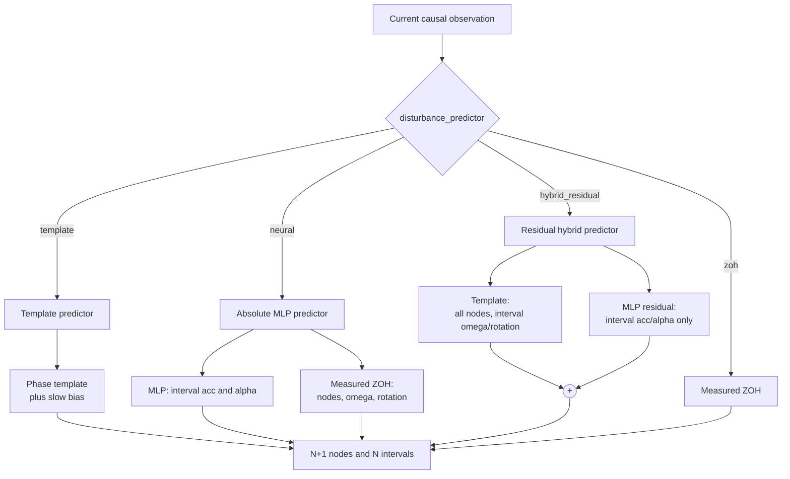
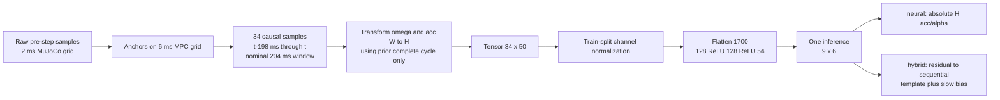
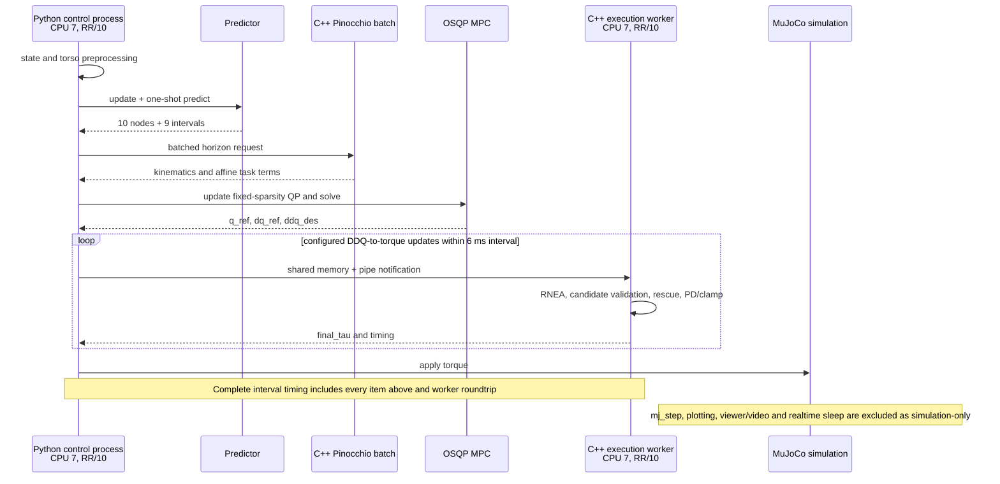
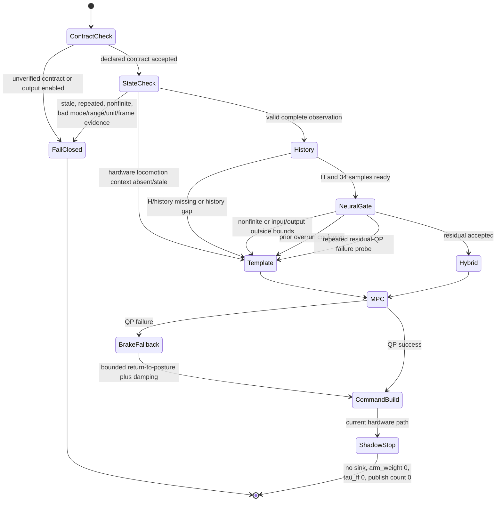

# Pre-hardware consolidation and simulation freeze

- Status: **simulation-validated / hardware-unverified**
- Frozen branch: `feat/predictor-interface`
- Control baseline: `main@384a157` plus B0--hardware-shadow development
- Evidence cutoff: 2026-08-12

This document is the engineering and thesis-facing snapshot immediately before
the first Unitree G1 session. It separates three kinds of evidence:

- **implemented**: present in this repository and covered by local tests;
- **simulation-validated**: measured in MuJoCo, including the PREEMPT_RT timing
  gate where stated;
- **hardware-unverified**: proposed or implemented hardware contract that has
  not yet been checked on the target G1.

Nothing in this document authorizes actuation. The current hardware path has no
command sink and is deliberately incapable of publishing a command. Detailed
read-only operating instructions remain in [HARDWARE_SHADOW.md](HARDWARE_SHADOW.md),
and realtime host preparation remains in [REALTIME_RUNTIME.md](REALTIME_RUNTIME.md).

## 1. Frozen control architecture

```mermaid
flowchart LR
    subgraph Source[State and locomotion source]
        SIM[MuJoCo state<br/>2 ms pre-step]
        HW[Future G1 state topics<br/>hardware-unverified]
        LOC[Locomotion policy context<br/>q target, command, phase]
    end

    SIM --> OBS[Canonical control observation]
    HW --> HWA[G1 hardware state adapter<br/>contract and freshness checks]
    HWA --> OBS
    LOC --> OBS

    OBS --> FILT[Causal torso acc/alpha filters]
    FILT --> PRED[Unified disturbance predictor<br/>update then predict]
    PRED --> PREVIEW[DisturbanceHorizon<br/>N+1 nodes and N intervals]
    OBS --> KH[KinematicsHelper]
    PREVIEW --> KH
    KH --> CPPKIN[C++ Pinocchio batched<br/>horizon kinematics]
    CPPKIN --> MPC[5-DOF arm MPC and OSQP]
    MPC --> DES[q_ref, dq_ref, ddq_des]

    DES --> SIMEXEC[Simulation execution path<br/>independent C++ worker]
    SIMEXEC --> RNEA[C++ Pinocchio RNEA]
    RNEA --> FD[MuJoCo candidate validation<br/>and safety rescue]
    FD --> TAU[final_tau to MuJoCo]

    DES --> SHADOW[Hardware shadow command builder]
    SHADOW --> NOSINK[In-memory proposal only<br/>arm_weight=0, tau_ff=0<br/>no publisher]
```



The predictor is not part of the MPC state-transition equation
`x[k+1] = A x[k] + B u[k]`. Disturbance preview enters the end-effector
acceleration, angular-acceleration, angular-velocity and gravity/tilt task
costs through `KinematicsHelper`. The QP state is right-arm `[q, dq]`, its
input is `ddq`, and only the first optimized input is passed down each update.

The common boundary between simulation and future hardware is the canonical
observation plus `DisturbanceHorizon`. MuJoCo contact propagation and candidate
force/acceleration validation are simulation-only; they must not be described
as a hardware contact or torque estimator.

## 2. Predictor family and current selection

Every implementation satisfies the same small interface:

```python
reset() -> None
update(observation: DisturbancePredictorObservation) -> None
predict(horizon: int, dt: float) -> DisturbanceHorizon
```



| Mode | Node preview | Interval acc/alpha | Interval omega/rotation | Runtime fallback |
|---|---|---|---|---|
| `template` | template; node 0 forced to measurement | template | template | measured ZOH before first complete gait cycle |
| `neural` | measured ZOH | absolute one-shot MLP | measured ZOH | measured ZOH |
| `hybrid_residual` | template unchanged | template + residual MLP | template unchanged | full template preview |
| `zoh` | measured ZOH | measured ZOH | measured ZOH | already ZOH |

The frozen simulation recommendation is `hybrid_residual`. `template` remains
the trusted safety baseline. Neural-only is retained for ablation, not selected
for hardware preparation: it improved acceleration metrics offline but lost the
template's future orientation/omega structure and produced much worse closed-
loop tilt in the generalization experiment.

## 3. H frame and preview time semantics

### H frame

For gait cycle `j`, the heading yaw is the circular mean of torso yaw over the
**previous complete cycle** `C[j-1]`. It is updated once at the cycle boundary
and held throughout `C[j]`. With `W_R_H = Rz(yaw_H)`, vectors transform as:

```text
v_H = W_R_H^T v_W = Rz(-yaw_H) v_W
v_W = W_R_H v_H
```

`H.z` remains aligned with the world gravity axis. This causal definition is
shared by phase templates, dataset construction and online MLP inference. The
first full gait cycle is history only; until an H frame exists, template and
hybrid return measured ZOH.

The template contains 400 start bins at 2 ms over the 0.8 s gait period. A
6 ms-aligned request uses a pre-expanded horizon lookup table. A request between
2 ms bins uses continuous periodic interpolation rather than nearest-neighbor
phase quantization. Template orientation is applied relative to the current
measured torso orientation. A slow EMA (`tau = 0.4 s`) adds only persistent
measurement-template bias while retaining the periodic component.

### Node versus interval

For one update at time `t`, `dt = 6 ms` and `N = 9`:

```mermaid
flowchart LR
    N0((node 0<br/>t<br/>measured))
    N1((node 1<br/>t+6 ms))
    ND[...]
    N8((node 8<br/>t+48 ms))
    N9((node 9<br/>t+54 ms))
    N0 -->|interval 0<br/>[t,t+6 ms)| N1
    N1 -->|interval 1| ND
    ND -->|interval 7| N8
    N8 -->|interval 8<br/>[t+48,t+54 ms)| N9
```

- `nodes[k]` is instantaneous at `t + k*dt`, `k = 0..N`; `nodes[0]` is always
  the current measured disturbance.
- `intervals[k]` represents the following half-open interval
  `[t+k*dt, t+(k+1)*dt)`, `k = 0..N-1`. Training labels use endpoint velocity
  differences over exactly this interval.
- For stages `k < N`, interval acc/omega/alpha form the end-effector linear and
  angular acceleration affine terms. Node omega and node rotation form the
  angular-velocity and gravity/orientation terms.
- The terminal cost consumes `nodes[N]` omega/rotation only; it has no control
  input or acceleration cost. Stored interval rotation is currently not read by
  `KinematicsHelper`.

Changing these meanings would invalidate both the template and learned model.

## 4. Causal 200 ms to 54 ms neural pipeline



The 50 feature channels per timestamp are:

| Feature group | Width | Frame/meaning |
|---|---:|---|
| torso angular velocity | 3 | H frame |
| torso linear acceleration | 3 | H frame |
| gravity direction | 3 | torso frame |
| lower-body `q`, `dq` | 12 + 12 | radians, rad/s |
| lower-body policy target | 12 | target joint positions |
| runtime command | 3 | `vx, vy, wz` |
| gait phase | 2 | `sin(phase), cos(phase)` |

Each output row is `[acc_H xyz, alpha_H xyz]` for one future 6 ms interval.
The MLP has hidden sizes 128/128, 241,206 parameters, CPU `eval()` execution and
one `torch.inference_mode()` call for the whole horizon.

Causality is structural rather than inferred after training:

- all raw signals are captured immediately before `mj_step`;
- history indices end at anchor `t`; no feature index exceeds the anchor;
- target `k` uses only endpoints `t+k*6 ms` and `t+(k+1)*6 ms`;
- H is computed only from a gait cycle ending no later than the anchor;
- train/validation/test split by whole episode (12/3/3), so adjacent windows
  from one episode never cross a split;
- normalization is fitted on train episodes only;
- residual checkpoints store and validate control period, H definition,
  template variant, slow-bias enable and time constant before online use.

## 5. Complete 6 ms timing path



The arm controller runs every three 2 ms physics steps. The frozen execution
mode is `right_arm_execution_runtime: process` and
`mpc_ddq_execution_mode: twice_per_interval`. The complete-interval metric is
the hardware-relevant software boundary: preprocessing, predictor, helper,
MPC/OSQP, joint PD, and all DDQ-to-torque calls. It does not pretend to measure
future DDS, fieldbus, firmware or sensor latency.

## 6. Safety and fallback state flow



Hybrid checks normalized input absolute/RMS range, normalized output range,
physical acc/alpha correction norms, finite values, prior complete-interval
overrun and consecutive QP failures. Any trigger returns the *complete template
preview*, not a partially corrected horizon. One isolated QP failure is handled
by MPC's bounded braking/posture fallback; repeated failures after a neural
correction cause a one-update template probe. The independent simulation worker
also treats a dead/stale/invalid session as poisoned and fails closed.

The hardware layer adds stricter gates before this flow: verified mappings and
frames, monotonic sample/tick, source age, state interval, mode, joint/IMU bounds
and temperature. The checked-in hardware YAML intentionally cannot pass the
full-shadow contract gate yet.

## 7. MuJoCo and G1 hardware boundary

| Boundary | MuJoCo path: simulation-validated | G1 path: hardware-unverified |
|---|---|---|
| state source | exact model `qpos/qvel`, sites, contacts | paired `rt/lowstate` + `rt/secondary_imu` host arrivals |
| torso state | model site pose/velocity/acceleration | declared quaternion/gyro/accelerometer conversion and causal alpha |
| locomotion inputs | policy target, command and gait phase available in process | transport/schema not yet known; hybrid falls back to template |
| common control | filters, predictor, `DisturbanceHorizon`, kinematics, MPC | same code after contract checks |
| execution | C++ RNEA plus MuJoCo candidate validation returns `final_tau` | only in-memory `q_ref/dq_ref/ddq_des` proposal |
| output | torque written to MuJoCo control | no command publisher; `ready_for_output=false` |

The state-only bridge pairs new messages from both topics when host-arrival skew
is at most 5 ms and stamps the pair with the older arrival, so freshness covers
both inputs. This implementation is **hardware-unverified**. The current bridge
source contains neither `LowCmd` nor `ChannelPublisher`; Python maps its shared
memory read-only/private. The separate output-capable adapter is outside this
shadow route and must not be launched.

## 8. Frozen configuration and evidence

### Controller and predictor configuration

| Item | Frozen value |
|---|---:|
| simulation/control period | 2 ms / 6 ms |
| MPC horizon | 9 (54 ms) |
| `mpc_q_ee_acc` | 0.01 |
| `mpc_q_ee_alpha` | 0.0005 |
| template variant / slow bias | `raw` / enabled, `tau=0.4 s` |
| checked-in default / best evaluated mode | `template` / `hybrid_residual` |
| MLP history/output | `34 x 50` / `9 x 6` |
| MLP hidden sizes / parameters | 128, 128 / 241,206 |
| prediction kinematics | batched C++ Pinocchio |
| simulation execution | independent C++ process, twice per 6 ms interval |

### Main validation results

All values below are repository result artifacts, not hardware measurements.

1. **QA/Qalpha freeze.** Six candidates times five repeats selected
   `QA=0.01`, `Qalpha=0.0005`; see
   [final validation](evaluation_summary/qa_qalpha_final_validation_20260806_144951/FINAL_VALIDATION_SUMMARY.md).
2. **B2 absolute MLP.** 18 episodes and 11,232 windows, split by episode into
   7,488/1,872/1,872 train/validation/test samples. Test RMSE was
   `0.1612 m/s^2` for acc and `0.7184 rad/s^2` for alpha; batch-1 CPU inference
   mean/p99/max was `0.0377/0.0492/0.0751 ms`. These are offline results; see
   [B2 summary](evaluation_summary/b2_mlp_baseline/summary.json).
3. **Residual MLP.** The hybrid checkpoint was retrained explicitly on
   `absolute target - sequential template-with-slow-bias`, not obtained by
   subtracting unrelated online quantities. Test hybrid RMSE was
   `0.1791 m/s^2` and `0.9043 rad/s^2`; see
   [residual summary](evaluation_summary/hybrid_residual_mlp/summary.json).
4. **Unseen-schedule generalization.** Across six schedule-only conditions
   (three unseen profiles times two seeds), hybrid improved end-effector acc in
   6/6 and alpha in 6/6 conditions. Paired mean improvements relative to
   template were `4.91%` acc, `8.78%` alpha and `2.68%` tilt. Tilt improved in
   5/6, with worst overall regression `-0.25%`. Start was most consistent
   (`6.03%` acc, `12.67%` alpha mean improvement); stop and velocity-change
   tilt gains were less consistent. See
   [generalization summary](evaluation_summary/hybrid_generalization_validation/summary.json).

   | Mode, 6 runs | EE acc RMS | EE alpha RMS | tilt RMS | QP success | DDQ saturation |
   |---|---:|---:|---:|---:|---:|
   | template | 2.570 | 7.512 | 0.06186 | 99.542% | 4.889% |
   | neural | **2.351** | **6.502** | 0.11269 | 99.604% | **0.167%** |
   | hybrid residual | 2.443 | 6.852 | **0.06021** | **99.583%** | 3.542% |

   Neural-only's low acc/alpha does not compensate for its `82%` larger tilt
   RMS than template. Hybrid is selected because it improves acc/alpha while
   preserving and slightly improving the physically important tilt metric.
5. **Payload diagnosis.** Four seeds each showed that the earlier QP loss was
   predominantly model mismatch: for 5 g, modeled versus unmodeled mean QP
   success was `99.03%` versus `98.09%`; for 10 g it was `99.25%` versus
   `95.47%`. Correct modeling also reduced the 10 g forward-dynamics model
   error RMS from `0.524` to approximately zero and removed the large tilt
   outlier. See
   [blocker diagnostics](evaluation_summary/readiness_blocker_diagnostics/summary.json).

### PREEMPT_RT target timing gate

The formal gate passed on `6.8.1-1057-realtime` with the complete physical core
6--7 isolated, control CPU 7, `performance` governor, `irqbalance` inactive,
no evaluation IRQ activity on the isolated core, numeric libraries single-
threaded, and both Python main and blocking C++ worker at `SCHED_RR/10`.

Across 3 unseen schedules x 4 seeds:

| Metric | Result |
|---|---:|
| runs / complete intervals | 12 / 9,588 |
| complete path mean / mean p99 / worst max | 3.215 / 3.568 / 4.006 ms |
| intervals over 6 ms | 0 |
| predictor mean / mean p99 / worst max | 0.499 / 0.627 / 0.866 ms |
| QP success mean / minimum run | 99.635% / 99.25% |
| DDQ saturation fraction mean | 3.51% |
| critical nonfinite | 0 |
| hybrid template fallbacks | 3 / 9,600 updates |
| IRQ increments on physical core during evaluation | 0 |

The strict gate required zero 6 ms overruns, worst sample `<6.0 ms`, every-run
p99 `<=5.5 ms`, every-run QP success `>=99%`, zero critical nonfinite and zero
evaluation IRQ activity. It passed; see
[target timing summary](evaluation_summary/realtime_timing_ablation/summary.json).
This establishes the simulation software timing baseline only. The first
hardware shadow run must separately measure state age, DDS wake-up, complete
state-to-command-build time and source-to-command age.

## 9. Hardware contracts still unconfirmed

The following must remain marked **hardware-unverified** until checked on the
actual robot/firmware; plausible values are not proof:

- exact G1 variant, 23-DOF/arm5 motor indices, signs, joint zero offsets and
  physical limits;
- presence, rate and type of `rt/secondary_imu`, and its timing relationship to
  `rt/lowstate`; whether 5 ms pairing is appropriate;
- robot `tick` unit, rate, monotonicity and wrap behavior;
- quaternion element order and direction (`world_from_imu` versus inverse),
  gyro frame/units, accelerometer frame/units and specific-force semantics;
- rigid torso-from-IMU rotation and sensor origin relative to MJCF
  `imu_in_torso`; a nonzero lever arm requires a measured translational
  correction that is not implemented;
- intended read-only `mode_pr` and `mode_machine` values;
- real lower-body policy-target, runtime-command and gait-phase transport,
  timestamps, update rates and gait epoch;
- floating-base translation/twist and contact state needed for trustworthy
  hardware inverse dynamics; the current shadow command has no validated
  feedforward torque semantics;
- firmware/SDK version compatibility, DDS/network latency and loss behavior;
- arm SDK command layout, arm-weight ownership, coexistence with the balance
  controller, gain/limit/temperature rules and emergency release behavior.

No verification flag in `configs/g1_hardware_shadow.yaml` should be changed
from observation alone. Each change needs a recorded source or a controlled
read-only measurement and review.

## 10. First hardware-day staged checklist

Each stage ends with a deliberate review. Do not advance automatically.

### Stage 0: physical and software safety setup

- [ ] Identify the exact robot, firmware, Unitree SDK and wired interface; keep
  the command-capable adapter stopped.
- [ ] Establish Unitree-approved power, support, workspace, emergency-stop and
  operator roles before any later actuation discussion.
- [ ] Re-run the realtime environment checker; keep DDS receive work on a
  housekeeping CPU and the control loop on isolated CPU 7.
- [ ] Build only `unitree_arm_state_bridge`; verify it has no LowCmd/publisher
  symbols and rejects output flags.

### Stage 1: read-only raw-state inspection

- [ ] Start only the state bridge on the explicitly chosen wired interface.
- [ ] Run `run_hardware_shadow.py --inspect-state-only`; do not run MPC yet.
- [ ] Record both topic rates, accepted/rejected source skew, state age, robot
  tick deltas, modes, quaternion norm, raw IMU values, joint q/dq and
  temperatures at rest.
- [ ] Cross-check message definitions and frame conventions against the exact
  firmware/SDK documentation; if safe and permitted, compare only passive or
  operator-guided joint changes with the declared map.
- [ ] Stop on any missing topic, inconsistent timestamp, unexplained mode,
  mapping, sign, unit, frame or temperature value.

### Stage 2: observation conversion shadow

- [ ] Update only hardware contract fields backed by Stage 1 evidence; review
  the diff and retain `output_enabled: false`.
- [ ] Validate world/torso orientation, gravity direction, static acceleration,
  angular velocity and causal alpha; measure IMU mounting transform/origin.
- [ ] Verify stale, duplicate, source-skew, unexpected-mode and nonfinite tests
  fail closed on the target data stream.
- [ ] Run template predictor and MPC in shadow; require finite results, stable
  QP behavior and no output capability. Hybrid remains template-only until the
  locomotion context contract is available.

### Stage 3: disabled-output command build

- [ ] Inspect every built 13-joint proposal: ordering, units, source sample,
  `q_ref/dq_ref/ddq_des`, gains and limits.
- [ ] Require `arm_weight=0`, `tau_ff=0`, `request_output=false`,
  `ready_for_output=false`, `publish_performed=false` and publish count zero.
- [ ] Run a repeated hardware shadow timing gate covering state age, predictor,
  MPC, command build, complete path and source-to-command age; define limits
  before accepting the data.
- [ ] Exercise stale state, locomotion-context dropout and forced bad data; all
  must stop or fall back exactly as documented.

### Stage 4: lowest-risk actuated test -- separate future authorization

- [ ] Do **not** enter this stage with the current code or based only on this
  document. It requires a separate actuation design review, explicit user
  authorization and an output-path implementation/test commit.
- [ ] Confirm vendor-supported control mode and balance-controller coexistence,
  full state/torque semantics, hard joint/gain/temperature limits, watchdog,
  dead-man release and human-accessible emergency stop.
- [ ] Begin supported and stationary, template-only, one right arm, reference
  equal to measured pose, zero feedforward and zero arm ownership; use a
  separately reviewed bounded ramp and short timeout.
- [ ] Abort on state age, mode change, timing overrun, QP failure streak,
  saturation, tracking error, unexpected force/motion, temperature or any
  operator concern. Walking and neural residual compensation are later tests,
  not part of the first actuation.

## 11. Freeze conclusion

The simulation phase has a reproducible quality baseline, a causally aligned
MLP/residual pipeline, a conservative hybrid fallback, and a strict PREEMPT_RT
timing pass. Hybrid is the best MuJoCo mode, while template is the first
hardware safety baseline. The repository is ready for a **first read-only G1
state inspection**, not for actuation and not yet for a claim of hardware
prediction benefit.
