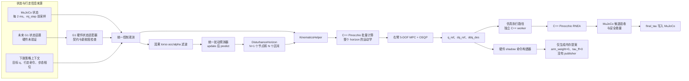
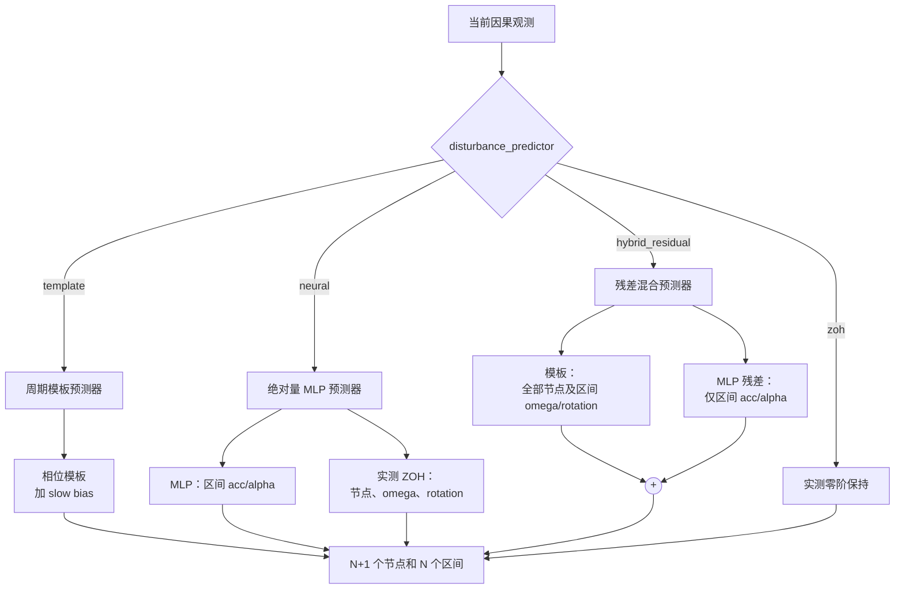
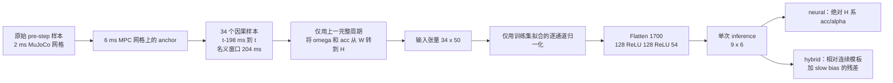
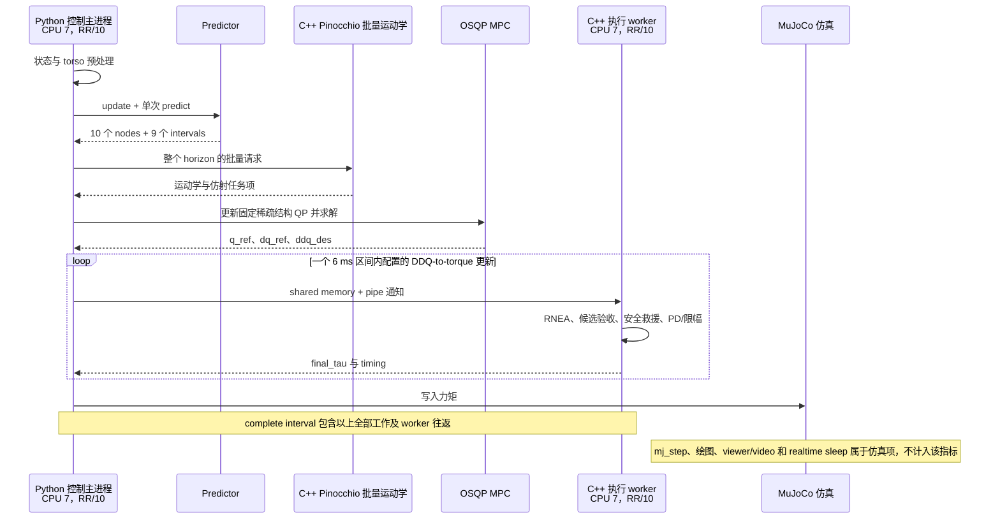
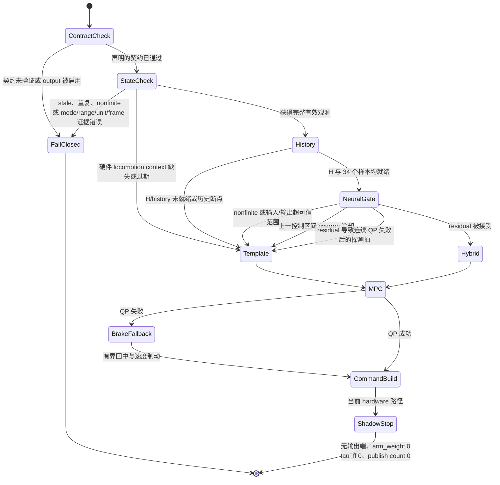

# 真机前整合与仿真冻结说明

- 状态：**仿真已验证 / 硬件未验证（hardware-unverified）**
- 冻结分支：`feat/predictor-interface`
- 控制基线：`main@384a157` 加 B0 至 hardware-shadow 阶段开发内容
- 证据截止日期：2026-08-12

本文档是第一次接触 Unitree G1 真机前，面向工程实现和论文写作的统一快照。
仓库总入口见 [README.md](README.md)，predictor 的完整设计见
[DISTURBANCE_PREDICTOR.md](DISTURBANCE_PREDICTOR.md)。
全文严格区分三类证据：

- **已实现**：代码已存在于本仓库，并有本地测试覆盖；
- **仿真已验证**：已在 MuJoCo 中测量；特别注明时，也包括 PREEMPT_RT
  timing gate 的结果；
- **硬件未验证**：已经提出或实现，但尚未在目标 G1 及其固件上确认的硬件契约。

本文档不构成任何真机执行授权。当前硬件路径没有命令输出端，并被设计为无法
发布控制命令。只读操作说明见 [HARDWARE_SHADOW.md](HARDWARE_SHADOW.md)，实时
运行环境准备见 [REALTIME_RUNTIME.md](REALTIME_RUNTIME.md)。

## 1. 冻结时的完整控制架构



预测扰动不进入 MPC 状态转移方程
`x[k+1] = A x[k] + B u[k]`。扰动 preview 通过 `KinematicsHelper` 进入末端
线加速度、角加速度、角速度以及重力/倾斜任务代价。QP 状态是右臂
`[q, dq]`，输入是 `ddq`，每次更新只向下游传递优化序列的第一拍。

仿真和未来真机路径的共同边界是统一观测和 `DisturbanceHorizon`。MuJoCo
接触传播以及候选力矩/加速度验收只属于仿真，不能描述成已完成的真机接触估计
或力矩估计。

## 2. Predictor 家族及当前选择

所有实现都满足同一个小接口：

```python
reset() -> None
update(observation: DisturbancePredictorObservation) -> None
predict(horizon: int, dt: float) -> DisturbanceHorizon
```



| 模式 | 节点 preview | 区间 acc/alpha | 区间 omega/rotation | 运行时 fallback |
|---|---|---|---|---|
| `template` | 模板，node 0 强制等于实测 | 模板 | 模板 | 第一完整步态周期前使用实测 ZOH |
| `neural` | 实测 ZOH | MLP 一次输出绝对量 | 实测 ZOH | 实测 ZOH |
| `hybrid_residual` | 模板完全不变 | 模板 + residual MLP | 模板完全不变 | 完整 template preview |
| `zoh` | 实测 ZOH | 实测 ZOH | 实测 ZOH | 本身就是 ZOH |

冻结时的仿真推荐模式是 `hybrid_residual`，`template` 仍是可信的安全基线。
neural-only 继续保留用于消融，但不作为真机准备的首选：它在线下明显改善了
acc/alpha，却失去了模板提供的未来姿态和 omega 结构，并在泛化闭环实验中造成
明显更大的 tilt。

## 3. H-frame 与 preview 时间语义

### 3.1 H-frame 定义

对于步态周期 `j`，heading yaw 使用**上一个完整周期** `C[j-1]` 内 torso yaw
的圆周均值。它只在周期边界更新一次，并在整个 `C[j]` 内保持不变。令
`W_R_H = Rz(yaw_H)`，则向量转换为：

```text
v_H = W_R_H^T v_W = Rz(-yaw_H) v_W
v_W = W_R_H v_H
```

`H.z` 始终与世界系重力轴对齐。相位模板、训练数据构建和在线 MLP inference
共同使用这一因果定义。第一个完整步态周期只用于积累历史；H-frame 尚未建立
时，template 和 hybrid 都返回实测 ZOH。

模板覆盖 0.8 s 步态周期，共 400 个 2 ms 起始 bin。对齐 6 ms 网格的请求使用
预展开的 horizon 查找表；起点落在两个 2 ms bin 之间时使用连续周期插值，不用
最近邻强行量化冲击相位。模板姿态以当前实测 torso 姿态为锚点。slow EMA
（`tau = 0.4 s`）只补偿持续存在的测量—模板偏差，同时保留快速周期分量。

### 3.2 Node 与 interval 定义

一次更新时间为 `t`，`dt = 6 ms`，`N = 9`：

```mermaid
flowchart LR
    N0((node 0<br/>t<br/>实测))
    N1((node 1<br/>t+6 ms))
    ND[...]
    N8((node 8<br/>t+48 ms))
    N9((node 9<br/>t+54 ms))
    N0 -->|interval 0<br/>[t,t+6 ms)| N1
    N1 -->|interval 1| ND
    ND -->|interval 7| N8
    N8 -->|interval 8<br/>[t+48,t+54 ms)| N9
```

- `nodes[k]` 是 `t + k*dt` 的瞬时量，`k = 0..N`；`nodes[0]` 始终严格等于
  当前实测扰动。
- `intervals[k]` 表示后续半开区间 `[t+k*dt, t+(k+1)*dt)`，
  `k = 0..N-1`。训练标签正是用该区间两端的速度差构造。
- 对 `k < N` 的阶段，区间 acc/omega/alpha 构成末端线加速度和角加速度的
  仿射项；节点 omega 与节点 rotation 构成角速度和重力/姿态项。
- 终端代价只消费 `nodes[N]` 的 omega/rotation；终端没有控制输入，也没有
  加速度代价。当前 `KinematicsHelper` 不读取已保存的 interval rotation。

改变这些语义会同时破坏模板和学习模型的有效性。

## 4. 因果的 200 ms 历史到 54 ms 预测流程



每个时间点的 50 个输入通道为：

| 特征组 | 宽度 | 坐标系/含义 |
|---|---:|---|
| torso angular velocity | 3 | H-frame |
| torso linear acceleration | 3 | H-frame |
| gravity direction | 3 | torso frame |
| lower-body `q`、`dq` | 12 + 12 | rad、rad/s |
| lower-body policy target | 12 | 目标关节位置 |
| runtime command | 3 | `vx, vy, wz` |
| gait phase | 2 | `sin(phase), cos(phase)` |

每个输出行是一个未来 6 ms 区间的
`[acc_H xyz, alpha_H xyz]`。MLP hidden size 为 128/128，共 241,206 个参数；
CPU 上以 `eval()` 运行，并在一次 `torch.inference_mode()` 调用中直接输出完整
horizon。

因果性由数据结构直接保证，而不是训练后再推断：

- 所有原始信号都在 `mj_step` 之前立即采样；
- 历史索引终止于 anchor `t`，没有任何特征索引超过 anchor；
- target `k` 只使用 `t+k*6 ms` 和 `t+(k+1)*6 ms` 两个端点；
- H-frame 只使用结束时间不晚于 anchor 的完整步态周期；
- train/validation/test 按完整 episode 划分为 12/3/3，同一 episode 的相邻
  窗口不会跨集合；
- normalization 只在 train episodes 上拟合；
- residual checkpoint 保存并在上线时校验控制周期、H-frame 定义、模板类型、
  slow-bias 开关和时间常数。

## 5. 完整 6 ms timing 路径



右臂控制器每三个 2 ms 物理步更新一次。冻结配置为
`right_arm_execution_runtime: process` 和
`mpc_ddq_execution_mode: twice_per_interval`。complete-interval 指标包含状态
预处理、predictor、helper、MPC/OSQP、关节 PD，以及 6 ms 内全部
DDQ-to-torque 调用，是与未来硬件最相关的软件计算边界。它不声称测量了未来的
DDS、现场总线、固件或传感器延迟。

## 6. Safety gate 与 fallback 状态流程



Hybrid 会检查归一化输入的绝对值/RMS、归一化输出范围、物理 acc/alpha 修正
范数、有限性、上一个完整区间是否 overrun，以及连续 QP 失败。任一 gate 触发
时都返回**完整 template preview**，不会返回只修正一部分的 horizon。单次 QP
失败由 MPC 的有界制动/回中 fallback 处理；residual 生效后连续失败则插入一个
template-only 探测拍。独立仿真 worker 对死亡、stale 或无效 session 也会永久
poison 当前会话并 fail closed。

硬件层在此之前增加更严格的 gate：已验证的映射和坐标系、单调 sample/tick、
状态年龄与采样间隔、mode、关节/IMU 范围和温度。仓库内的硬件 YAML 目前被
有意设置为无法通过 full-shadow contract gate。

## 7. MuJoCo 与 G1 硬件适配器边界

| 边界 | MuJoCo 路径：仿真已验证 | G1 路径：硬件未验证 |
|---|---|---|
| 状态来源 | 精确模型 `qpos/qvel`、site、contact | 按主机到达时间配对 `rt/lowstate` 与 `rt/secondary_imu` |
| torso 状态 | 模型 site 的姿态/速度/加速度 | 声明的 quaternion/gyro/accelerometer 转换及因果 alpha |
| 行走输入 | 进程内可取得 policy target、command、gait phase | transport/schema 未知；hybrid 回退 template |
| 共用控制 | filter、predictor、`DisturbanceHorizon`、kinematics、MPC | 契约检查后复用相同代码 |
| 执行 | C++ RNEA + MuJoCo 候选验收返回 `final_tau` | 仅构建内存中的 `q_ref/dq_ref/ddq_des` 提案 |
| 输出 | 力矩写入 MuJoCo control | 无 command publisher；`ready_for_output=false` |

state-only bridge 仅在两个话题都提供新消息且主机到达偏差不超过 5 ms 时生成
配对状态，并以两者中较早的到达时刻作为时间戳，使 freshness 同时覆盖两个
来源。这一实现仍是**硬件未验证**。当前 bridge 源码既不包含 `LowCmd`，也不
包含 `ChannelPublisher`；Python 使用只读文件描述符和 private mapping 访问
共享内存。另一个具有输出能力的 adapter 不在这条 shadow 路径中，不能启动。

## 8. 冻结配置与实验依据

### 8.1 控制器和 predictor 配置

| 项目 | 冻结值 |
|---|---:|
| simulation/control period | 2 ms / 6 ms |
| MPC horizon | 9（54 ms） |
| `mpc_q_ee_acc` | 0.01 |
| `mpc_q_ee_alpha` | 0.0005 |
| template 类型 / slow bias | `raw` / 启用，`tau=0.4 s` |
| 仓库默认模式 / 最佳已评估模式 | `template` / `hybrid_residual` |
| MLP history/output | `34 x 50` / `9 x 6` |
| MLP hidden sizes / 参数量 | 128、128 / 241,206 |
| prediction kinematics | 批量 C++ Pinocchio |
| 仿真执行 | 独立 C++ process，每个 6 ms 区间执行两次验收 |

### 8.2 主要验证结果

以下全部是仓库中的仿真结果，不是真机测量：

1. **QA/Qalpha 冻结。** 6 个候选各重复 5 次，最终选择
   `QA=0.01`、`Qalpha=0.0005`。见
   [最终验证](evaluation_summary/qa_qalpha_final_validation_20260806_144951/FINAL_VALIDATION_SUMMARY.md)。
2. **B2 absolute MLP。** 共 18 个 episodes、11,232 个窗口；按 episode
   划分为 7,488/1,872/1,872 个 train/validation/test 样本。test acc RMSE
   为 `0.1612 m/s^2`，alpha RMSE 为 `0.7184 rad/s^2`；batch-1 CPU inference
   的 mean/p99/max 为 `0.0377/0.0492/0.0751 ms`。这些是离线结果，见
   [B2 摘要](evaluation_summary/b2_mlp_baseline/summary.json)。
3. **Residual MLP。** Hybrid checkpoint 明确以
   `absolute target - sequential template-with-slow-bias` 重新训练，不是把
   时间语义不同的在线量直接相减。test hybrid acc/alpha RMSE 分别为
   `0.1791 m/s^2` 和 `0.9043 rad/s^2`。见
   [residual 摘要](evaluation_summary/hybrid_residual_mlp/summary.json)。
4. **Unseen schedule 泛化。** 在 6 个仅改变 schedule 的 unseen 条件
   （3 profiles x 2 seeds）中，hybrid 对末端 acc 和 alpha 都是 6/6 改善。
   相对 template 的配对平均改善为 acc `4.91%`、alpha `8.78%`、tilt
   `2.68%`。tilt 在 5/6 条件中改善，最差整体退化为 `-0.25%`。start 最
   稳定，acc/alpha 平均改善 `6.03%/12.67%`；stop 和 velocity-change 的
   tilt 收益波动更大。见
   [泛化摘要](evaluation_summary/hybrid_generalization_validation/summary.json)。

   | 模式（各 6 runs） | EE acc RMS | EE alpha RMS | tilt RMS | QP success | DDQ saturation |
   |---|---:|---:|---:|---:|---:|
   | template | 2.570 | 7.512 | 0.06186 | 99.542% | 4.889% |
   | neural | **2.351** | **6.502** | 0.11269 | 99.604% | **0.167%** |
   | `hybrid_residual` | 2.443 | 6.852 | **0.06021** | **99.583%** | 3.542% |

   neural-only 较低的 acc/alpha 无法抵消其比 template 高约 `82%` 的 tilt RMS。
   因此 hybrid 被选中：它改善 acc/alpha，同时保留并略微改善最重要的 tilt。
5. **Payload 诊断。** 5 g 和 10 g 各用 4 个 seeds 验证，说明之前 QP success
   降低主要来自 model mismatch。5 g correctly modeled 与 unmodeled 的平均 QP
   success 为 `99.03%` 与 `98.09%`；10 g 为 `99.25%` 与 `95.47%`。正确
   建模还把 10 g forward-dynamics model error RMS 从 `0.524` 降至近零，并
   消除了 tilt 大离群值。见
   [blocker 诊断](evaluation_summary/readiness_blocker_diagnostics/summary.json)。

### 8.3 PREEMPT_RT target timing gate

正式 timing gate 已在 `6.8.1-1057-realtime` 上通过。运行条件是：完整物理核
6--7 隔离、control CPU 7、`performance` governor、`irqbalance` inactive、
评估期间隔离核无 IRQ、数值库单线程，Python main 和阻塞式 C++ worker 均为
`SCHED_RR/10`。

3 个 unseen schedules x 4 seeds 的结果为：

| 指标 | 结果 |
|---|---:|
| runs / complete intervals | 12 / 9,588 |
| complete path mean / mean p99 / worst max | 3.215 / 3.568 / 4.006 ms |
| 超过 6 ms 的区间数 | 0 |
| predictor mean / mean p99 / worst max | 0.499 / 0.627 / 0.866 ms |
| QP success 平均值 / 单 run 最低值 | 99.635% / 99.25% |
| DDQ saturation fraction 平均值 | 3.51% |
| critical nonfinite | 0 |
| hybrid 回退 template 次数 | 3 / 9,600 updates |
| evaluation 期间物理核 IRQ 增量 | 0 |

严格 gate 要求：6 ms overrun 为零、worst sample `<6.0 ms`、每个 run 的 p99
均 `<=5.5 ms`、每个 run 的 QP success 均 `>=99%`、critical nonfinite 为零，
且 evaluation 期间隔离物理核 IRQ 增量为零。全部通过，见
[target timing 摘要](evaluation_summary/realtime_timing_ablation/summary.json)。
这只建立了仿真软件 timing 基线。第一次硬件 shadow 还必须单独测量 state age、
DDS 唤醒、完整 state-to-command-build 时间和 source-to-command age。

## 9. 尚未确认的硬件契约

以下项目在目标机器人/固件上确认之前，必须继续标记为**硬件未验证**。数值看似
合理不能证明契约成立：

- 精确 G1 型号、23-DOF/arm5 电机索引、符号、关节零偏和物理限位；
- `rt/secondary_imu` 是否存在、频率和消息类型，以及它与 `rt/lowstate` 的
  时间关系；5 ms 配对阈值是否合适；
- robot `tick` 的单位、频率、单调性和 wrap 行为；
- quaternion 元素顺序与方向（`world_from_imu` 还是其逆）、gyro 坐标系/单位、
  accelerometer 坐标系/单位及 specific-force 语义；
- torso-from-IMU 固定旋转和传感器原点相对 MJCF `imu_in_torso` 的位置；若
  存在非零杆臂，需要实测平移和杆臂加速度修正，当前尚未实现；
- 只读目标工作状态下允许的 `mode_pr` 和 `mode_machine`；
- 真机 lower-body policy target、runtime command 和 gait phase 的 transport、
  timestamp、更新率及 gait epoch；
- 可信真机逆动力学需要的 floating-base 平移/速度和 contact state；当前 shadow
  command 没有经过验证的 feedforward torque 语义；
- 固件/SDK 版本兼容性、DDS/网络延迟和丢包行为；
- Arm SDK command 布局、arm-weight 所有权、与 balance controller 的并存规则、
  gain/limit/temperature 规则以及紧急释放行为。

不能只根据一次观测就修改 `configs/g1_hardware_shadow.yaml` 中的 verification
flag。每项修改都需要可记录的接口依据，或受控只读测量结果及代码审查。

## 10. 第一次上真机的分阶段 checklist

每个阶段结束后都必须人工复核，不能自动进入下一阶段。

### Stage 0：物理与软件安全准备

- [ ] 确认精确机器人型号、固件、Unitree SDK 和有线网卡；保持具有输出能力的
  adapter 关闭。
- [ ] 在讨论任何执行前，按 Unitree 要求准备供电、支撑、工作空间、急停和人员
  分工。
- [ ] 重新运行 realtime environment checker；DDS 接收留在 housekeeping CPU，
  控制循环固定在隔离的 CPU 7。
- [ ] 只构建 `unitree_arm_state_bridge`；确认没有 LowCmd/publisher 符号，并且
  拒绝 output 参数。

### Stage 1：只读原始状态检查

- [ ] 只在明确选择的有线网卡上启动 state bridge。
- [ ] 运行 `run_hardware_shadow.py --inspect-state-only`，暂不运行 MPC。
- [ ] 记录两个话题的频率、接受/拒绝的 source skew、state age、robot tick
  增量、mode、quaternion norm、原始 IMU、静止时关节 q/dq 和温度。
- [ ] 根据精确固件/SDK 文档交叉确认消息定义与坐标系；仅在安全且获准时，通过
  被动或由操作人员缓慢移动关节核对映射。
- [ ] 遇到话题缺失、时间戳不一致、无法解释的 mode、mapping、符号、单位、
  坐标系或温度时立即停止。

### Stage 2：观测转换 shadow

- [ ] 只更新有 Stage 1 证据支持的硬件契约字段；审查 diff，并保持
  `output_enabled: false`。
- [ ] 验证世界/torso 姿态、gravity direction、静态加速度、角速度和因果 alpha；
  测量 IMU 安装变换和原点。
- [ ] 在真实数据流上确认 stale、duplicate、source-skew、unexpected-mode 和
  nonfinite 都会 fail closed。
- [ ] 以 template 运行 predictor + MPC shadow；要求结果有限、QP 稳定且没有
  输出能力。在 locomotion context 契约建立前，hybrid 必须继续回退 template。

### Stage 3：禁用输出的 command build

- [ ] 检查每一个 13-joint command proposal：顺序、单位、source sample、
  `q_ref/dq_ref/ddq_des`、gain 和 limit。
- [ ] 必须确认 `arm_weight=0`、`tau_ff=0`、`request_output=false`、
  `ready_for_output=false`、`publish_performed=false`，且 publish count 为零。
- [ ] 运行重复 hardware shadow timing gate，覆盖 state age、predictor、MPC、
  command build、complete path 和 source-to-command age；先定义门槛，再接受结果。
- [ ] 主动测试 stale state、locomotion-context dropout 和强制错误数据；所有情况
  必须严格按文档停止或 fallback。

### Stage 4：最低风险 actuated test——需要未来单独授权

- [ ] **当前代码和本文档都不允许进入该阶段。** 必须另行完成执行设计审查、
  获得用户明确授权，并提交和测试真正的输出路径。
- [ ] 确认厂商支持的控制 mode、与 balance controller 的并存方式、完整状态/
  力矩语义、硬性关节/gain/temperature 限制、watchdog、dead-man release 和人员
  可直接触达的急停。
- [ ] 机器人可靠支撑并保持静止；仅使用 template、仅右臂、reference 等于实测
  姿态、零 feedforward、零 arm ownership；只使用另行审查过的有界 ramp 和短
  timeout。
- [ ] state age、mode change、timing overrun、QP failure streak、saturation、
  tracking error、意外受力/运动、温度或操作人员主观担忧任一出现都立即停止。
  行走和 neural residual 补偿属于之后的测试，不属于第一次 actuated test。

## 11. 冻结结论

仿真阶段已经具备可复现的质量基线、因果对齐的 MLP/residual pipeline、保守的
hybrid fallback，以及严格通过的 PREEMPT_RT timing gate。Hybrid 是当前最佳
MuJoCo 闭环模式，template 是第一次硬件测试的安全基线。仓库已经具备**第一次
G1 只读状态检查**的代码条件，但不具备执行条件，也不能声称神经预测在真机上
已经产生收益。
