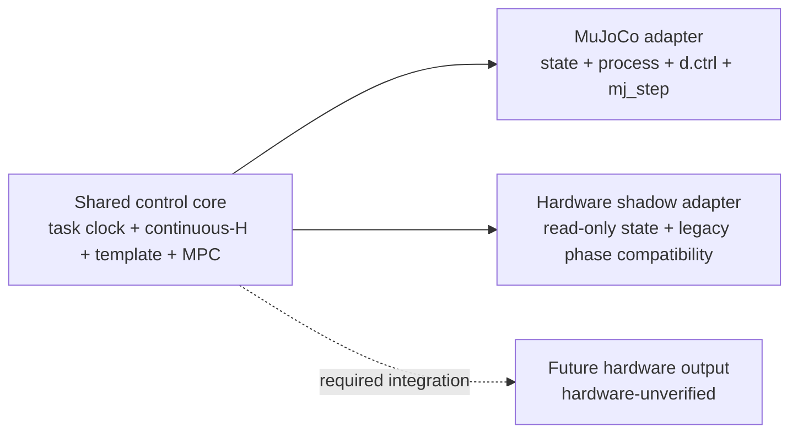

# hold-my-beer-mpc

`hold-my-beer-mpc` 研究 Unitree G1 行走时的躯干扰动预测与右臂 MPC 稳杯控制。
当前冻结候选只有一条：**MPC + `FullTaskTemplatePredictor` v2**。模板按固定任务的
绝对时间查询；神经扰动预测路线已经冻结并从当前源码移除。下肢行走仍使用仓库内
的 Torch RL policy，这与已删除的 neural disturbance predictor 是两件不同的事。

当前正式结论只来自受控 MuJoCo 仿真，不是真机闭环或硬实时证据。

## 冻结方案

```text
task t=0:       立即发布正式前进命令，heading control 开启
[0, 24 ms):    右臂固定姿态 PD；该区间属于 headline
20 ms:         下肢产生第一份新的 policy action
24 ms:         6 ms anchor 4，右臂 MPC/process 接管
[0, 6.4 s):    planned vx=0.5 m/s, vy=0
6.4 s:         planned vx/vy 直接切为零，不使用 ramp
[0, 8.0 s):    唯一 headline
8.052 s:       最后一个 54 ms horizon 的末节点
```

任务时钟、gait clock、continuous-H 和模板时钟都从 `t=0` 连续推进；24 ms 接管时
不会 reset 或从模板开头重播。接管前最后一个物理步实际执行的右臂 PD 力矩作为
`previous_executed_tau` 传入安全执行链。

正式模板资产被显式固定，不扫描“最新”目录：

- [`full_task_template.npz`](disturbance_template/data/full_task_template_v2/20260815_162850/full_task_template.npz)，SHA256
  `d4a0109adcff696936ef96160976161833ff9a7a7531e2e5d7ad9e50c10e17d4`；
- [`full_task_template_manifest.json`](disturbance_template/data/full_task_template_v2/20260815_162850/full_task_template_manifest.json)，SHA256
  `6b48ee196d1f7d923dde057d3c0fb0e182f08512a65402c4c39c5e070a3243c6`。

这个模板提前知道 6.4 s 的停车时刻。它是固定任务 baseline，不泛化到任意速度、
方向或未知停车时刻。

## 唯一正式仿真入口

所有正式 full-task 实验必须通过仓库根目录唯一的 [`run.sh`](run.sh) 启动。
preflight 会在第一个 `mj_step` 前检查 parent/worker 都只绑定 CPU 7、六个数值库
线程变量和 Torch intra/inter-op 都为 1，并确认控制循环关闭 GC。正式 nominal
命令是：

```bash
cd /path/to/hold-my-beer-mpc
MPC_CONTROL_CPU=7 MPC_CONTROL_NUM_THREADS=1 ./run.sh \
  --full-task-smoke \
  --disturbance-predictor full_task_template \
  --right-arm-runtime-mode process \
  --startup-pd-duration 0.024 \
  --headless \
  --no-video \
  --run-label final_freeze
```

不要绕过 `run.sh` 直接执行 `python main_sim.py`；宽 CPU affinity 或缺失线程环境
不是正式运行条件。

## 验证状态

轻量证据在
[`evaluation_summary/full_task_template_v2_final_freeze/`](evaluation_summary/full_task_template_v2_final_freeze/)。
以下数字只引用清理前已经完成的 CPU 7 受控历史证据，包含 nominal 3 次和
`heldout_pair_02_minus` 3 次；本文不预填后续冻结复跑结果：

| 范围 | 完整 6 ms 区间 | mean / p95 / p99 / max | `>6 ms` |
|---|---:|---|---:|
| nominal，3 次 | 3,987 | 3.437 / 3.659 / 3.803 / 4.500 ms | 0 |
| held-out，3 次 | 3,987 | 3.400 / 3.591 / 3.721 / 4.511 ms | 0 |
| 合计 | 7,974 | 3.419 / 3.630 / 3.775 / 4.511 ms | 0 |

六条运行的 parent/worker affinity 均为 `[7]`，线程与 GC preflight 均通过；
`predictor fallback=0`、`QP fallback=0`、`final_unsafe=0`、
`NO_SAFE_TORQUE=0`、跌倒和 NaN/Inf 均为 0。16,074 次 mapper 执行调用中未认证
输出为 0。rescue 和已认证 hold-last 仍作为诊断保留，不能与未认证输出混为一谈。

这些是该主机上的 MuJoCo 完整控制区间结果，不能外推为目标 G1 的 deadline、
DDS 延迟、接触估计或实际力矩安全证据。

### r1 最终冻结复跑

汇总语义修正后，从同一正式 `run.sh` 路径各执行了一条 nominal 和
`heldout_pair_02_minus`。轻量证据写入
`evaluation_summary/full_task_template_v2_final_freeze/final_runs_r1/`：

| 场景 | 完整 6 ms 区间 | mean / p95 / p99 / max | `>6 ms` | tilt RMS | position RMS | XY displacement |
|---|---:|---|---:|---:|---:|---:|
| nominal | 1,329 | 3.302370 / 3.464462 / 3.630513 / 4.340295 ms | 0 | 0.002617404 rad | 0.013735420 m | 3.222744 m |
| held-out | 1,329 | 3.299516 / 3.456565 / 3.532013 / 4.228574 ms | 0 | 0.002573218 rad | 0.013679703 m | 3.212114 m |

两条运行都确认 parent/worker affinity 为 `[7]`、六个数值库线程环境变量为 `1`、
Torch intra/inter-op 为 `1/1`、控制循环 GC 关闭、dynamic arming 为 `false`，并在
24 ms 的 anchor 4 接管。每条各有 2,679 次 mapper 调用；nominal 的
rescue/hold-last 为 `2/0`，held-out 为 `3/1`，所有实际输出仍通过认证。
`predictor fallback`、`QP fallback`、`final_unsafe`、`NO_SAFE_TORQUE`、未认证输出、
跌倒和 NaN/Inf 均为 0，因此显式冻结验收门均为 PASS。

两条 r1 `full_task_smoke_summary` 均为 `status=PASS`、`smoke_passed=true`、
`nominal_mapping_path_passed=false`。mapping fallback 原始计数分别为 `3/5`，并保留
`MAPPING_SAFETY_FALLBACK_USED` warning；PASS 表示 task/protocol 门通过，不表示全程
走 nominal mapping path。真正安全门仍是 `final_output_certified`、`final_unsafe`、
`NO_SAFE_TORQUE`、跌倒、NaN/Inf 和完整 6 ms deadline。

旧 tag `full-task-template-v2-final-freeze-20260816` 下 `final_runs/` 的原始 summary
保持未改，仍使用“fallback 即 FAIL”的 legacy 汇总语义，仅作历史证据。

## 架构边界

项目只维护一份正式 full-task predictor 和一份 MPC；另保留的 legacy
phase/ZOH 只服务 shadow 兼容和最小接口回归：



- 仿真正式链：`run.sh -> main_sim.py -> RightArmSimProcess -> C++ simulation
  runtime -> mapper-certified feedforward + latest-state executor PD/guards -> final_tau
  -> d.ctrl -> mj_step`。mapper 只在 0/4 ms 更新拍重做 forward-dynamics 认证。
- hardware shadow 当前只读、`command_publish_count=0`，仍是 legacy phase-template
  兼容路径；它尚未接入 full-task v2 的任务时钟、continuous-H 和 24 ms handoff。
- `cpp/unitree_arm_adapter` 是未来真机适配边界，但主动真机闭环仍为
  **hardware-unverified**。

完整依赖和验证边界见 [ARCHITECTURE.md](ARCHITECTURE.md)。

## 推荐阅读顺序

1. [FULL_TASK_TEMPLATE.md](FULL_TASK_TEMPLATE.md)：固定任务协议、continuous-H、
   模板 schema、在线查询、24 ms handoff 与证据边界。
2. [ARCHITECTURE.md](ARCHITECTURE.md)：共享控制核心、MuJoCo adapter、只读 hardware
   shadow 与未来真机输出边界。
3. [PRE_HARDWARE_FREEZE.md](PRE_HARDWARE_FREEZE.md)：冻结门槛、安全结论及真机前缺口。
4. [MPC_DESIGN.md](MPC_DESIGN.md)：右臂 MPC 数学、QP 和执行合同。
5. [HEADING_CONTROL.md](HEADING_CONTROL.md)：direct-step planned/runtime command、20 ms 命令更新
   和 heading controller 与 continuous-H 的边界。
6. [REALTIME_RUNTIME.md](REALTIME_RUNTIME.md)：完整 6 ms 计时口径和 CPU 7 环境。
7. [HARDWARE_SHADOW.md](HARDWARE_SHADOW.md)：只读 shadow 的能力与禁止声明。
8. [disturbance_template/README.md](disturbance_template/README.md)：v2 的离线来源、
   schema、parity 和本地产物边界。
9. [right_arm_runtime/README.md](right_arm_runtime/README.md)：process、seqlock 与安全
   输出链。

[CHALLENGE.md](CHALLENGE.md) 保留工程案例；旧开发日志和路线图不是当前正式方案。

## Git、证据与历史恢复

正式运行所需的 v2 NPZ、manifest 和 held-out 初态 manifest 已纳入 Git。大型 raw、
trajectory、视频和原始 evaluation 不进入活跃仓库；压缩归档、删除清单和 SHA256
索引见
[`cleanup_manifest.json`](evaluation_summary/full_task_template_v2_final_freeze/cleanup_manifest.json)。

清理前的完整工作树可由本地分支
`archive/pre-cleanup-full-task-v2-20260815`、commit
`70eb33b51656b958648ea013bc9bd45aa72dfa73` 或 annotated tag
`checkpoint/full-task-v2-24ms-20260815` 恢复。若只恢复历史 neural 文件，使用：

```text
git restore --source=<old-neural-commit> -- <path>
```

若审阅整条历史 neural 路线，应从对应旧 commit 新建独立 archive 分支，不要把它
重新混入当前正式控制分支。下肢 `policy/motion.pt` 和 Torch 推理仍是正式行走链的
必要组成，不属于已移除的 neural disturbance predictor。
