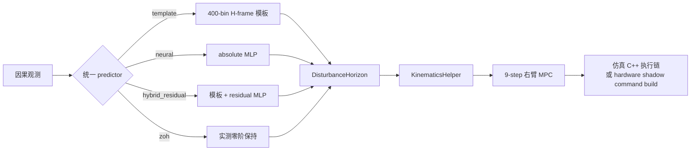

# disturbance-lab

`disturbance-lab` 是从 `jiakefu9-hub/hold-my-beer-mpc@384a157` 分出的独立开发仓库，
用于研究 Unitree G1 行走时的 torso 扰动预测与右臂 MPC 稳杯控制。项目不采用强化
学习重新训练整机策略，而是在已有周期模板上加入一个小型监督学习残差模型：

```text
disturbance prediction = periodic template prediction + neural residual prediction
```

## 当前状态

- **仿真已验证**：MPC、统一 predictor、absolute/residual MLP、闭环消融、泛化、
  payload 诊断和 PREEMPT_RT target timing gate 均已有可复现实验依据。
- **当前综合最优模式**：`hybrid_residual`。它保留 template 的未来姿态/角速度结构，
  只用 MLP 修正未来 9 个区间的 H-frame 线加速度和角加速度。
- **仓库安全默认值**：`template`。本地 residual checkpoint 未生成时，fresh clone
  仍可运行可信模板基线。
- **硬件未验证（hardware-unverified）**：G1 state-only bridge 和 shadow command
  build 已实现，但目标机器人上的关节、IMU、时间戳及控制契约尚未确认；当前
  shadow 路径没有 command publisher，不能驱动机器人。
- **未开展**：GRU 和任何真机有效控制输出。

本文档统一使用配置值 `template`、`neural`、`hybrid_residual`、`zoh`；
H-frame（中文简称 H 系）指重力对齐的 heading frame；`node` 指预测时刻瞬时量，
`interval` 指紧随该 node 的 6 ms 半开区间量；所有未在目标 G1 上确认的路径统一
标为 **硬件未验证（hardware-unverified）**。



## 主要仿真结论

- 冻结 MPC 权重：`mpc_q_ee_acc=0.01`、`mpc_q_ee_alpha=0.0005`。
- 18 个 episode 共 11,232 个窗口；200 ms 因果历史输入一次预测未来
  `9 x 6 ms = 54 ms` 的 acc/alpha。
- 6 个 unseen schedule 条件中，`hybrid_residual` 相对 template 的末端 acc 和
  alpha 均为 6/6 改善，配对平均改善分别为 `4.91%` 和 `8.78%`；tilt 平均改善
  `2.68%`。neural-only 虽有更低 acc/alpha，但 tilt 比 template 高约 `82%`，
  因而不是当前推荐闭环模式。
- PREEMPT_RT gate 在 12 runs、9,588 个完整控制区间上通过：完整路径
  mean/mean-p99/worst-max 为 `3.215/3.568/4.006 ms`，`>6 ms` 为 0，评估期间
  隔离物理核 IRQ 增量为 0。

这些结果均来自 MuJoCo/本机 realtime 验证，不是真机控制效果。完整数值、证据
边界和第一次真机 checklist 以
[PRE_HARDWARE_FREEZE.md](PRE_HARDWARE_FREEZE.md) 为准。

## 推荐阅读顺序

1. [PRE_HARDWARE_FREEZE.md](PRE_HARDWARE_FREEZE.md)：当前事实基准、完整架构、
   冻结结果与真机前缺口。
2. [DISTURBANCE_PREDICTOR.md](DISTURBANCE_PREDICTOR.md)：template、neural、
   `hybrid_residual`、数据时间语义和 safety fallback。
3. [MPC_DESIGN.md](MPC_DESIGN.md)：右臂 MPC 数学、QP、执行链及 predictor 接口边界。
4. [disturbance_learning/README.md](disturbance_learning/README.md)：数据采集、训练、
   本地 artifact 与消融复现。
5. [REALTIME_RUNTIME.md](REALTIME_RUNTIME.md)：PREEMPT_RT、CPU/IRQ isolation 和
   6 ms target timing gate。
6. [HARDWARE_SHADOW.md](HARDWARE_SHADOW.md)：hardware-unverified 的只读与 shadow
   路径，明确的无输出安全边界。
7. [MPC_DEVELOPMENT_LOG.md](MPC_DEVELOPMENT_LOG.md) 与
   [CHALLENGE.md](CHALLENGE.md)：阶段记录和关键工程案例。

[PLAN.md](PLAN.md) 是历史路线图，已被当前冻结文档取代，不应作为现行方案。

## 仓库数据边界

`disturbance_learning/data/`、`disturbance_learning/artifacts/` 和 `evaluation/`
均为 gitignored 本地产物；大型 episode、checkpoint、原始日志和视频不得提交。
可审查的轻量结果保存在 `evaluation_summary/`。所有开发和 push 只面向本仓库，
不得向只读上游 `hold-my-beer-mpc` 推送。
