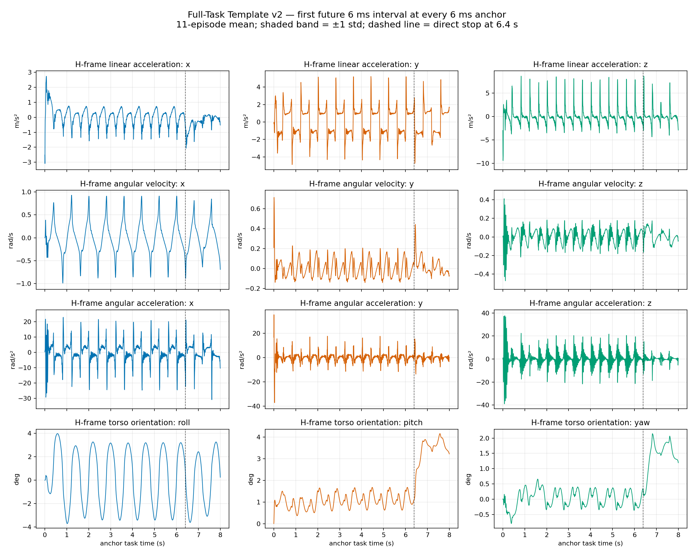

# Full-task template data and validation

本目录保留 `FullTaskTemplatePredictor` v2 所需的协议、固定右臂 PD 采集、离线模板
构建、runtime-safe 资产校验、offline-online parity 和结果整理代码。当前项目不再
开发 neural/hybrid disturbance predictor；训练、checkpoint 和 ablation 源码已从
正式分支删除。

下肢行走仍由根控制循环加载 `policy/motion.pt` 并执行 Torch 推理。它是 locomotion
controller，不是已移除的 neural disturbance predictor。

时间语义和在线行为以 [FULL_TASK_TEMPLATE.md](../FULL_TASK_TEMPLATE.md) 为准，
平台边界见 [ARCHITECTURE.md](../ARCHITECTURE.md)。

## 目录职责

| 文件 | 当前职责 |
|---|---|
| [`full_task_protocol.py`](full_task_protocol.py) | direct-step protocol、2/6/20 ms grid、task clock、legacy/v2 H helper；正式 v2 使用 continuous-H |
| [`full_task_recording.py`](full_task_recording.py) | versioned 2 ms strict pre-step raw、schema/manifest、smoke summary |
| [`full_task_fixed_pd_collector.py`](full_task_fixed_pd_collector.py) | 下肢正常运行、右臂 fixed-posture PD 的 11 build + 4 held-out 采集 |
| [`full_task_template_builder.py`](full_task_template_builder.py) | 6 ms future window、SO(3) 平均、单一绝对时间模板与 held-out 评价 |
| [`full_task_template_asset.py`](full_task_template_asset.py) | 小型 runtime-only loader、SHA256/schema/shape/SO(3) 校验 |
| [`full_task_online_parity.py`](full_task_online_parity.py) | 对 held-out raw 逐 anchor 重放在线 predictor |
| [`full_task_startup_pd.py`](full_task_startup_pd.py) | 正式 24 ms fixed-PD handoff、接触诊断和切换证据 |
| [`full_task_runtime_preflight.py`](full_task_runtime_preflight.py) | CPU affinity、线程环境、Torch 和 GC 的正式 fail-fast 检查 |
| `full_task_*_report.py` | 已有 full-task 运行的只读汇总与绘图，不参与在线控制 |

在线 predictor 只依赖 `full_task_template_asset.py`，不会为了读取 NPZ 把 collector、
plotting 或跨 episode builder 导入控制进程。

## 冻结资产

正式 runtime 只接受这组显式资产：

```text
disturbance_template/data/full_task_template_v2/20260815_162850/
  full_task_template.npz
  full_task_template_manifest.json
  episodes/heldout_pair_02_minus/episode_manifest.json
```

| 文件 | SHA256 |
|---|---|
| `full_task_template.npz` | `d4a0109adcff696936ef96160976161833ff9a7a7531e2e5d7ad9e50c10e17d4` |
| `full_task_template_manifest.json` | `6b48ee196d1f7d923dde057d3c0fb0e182f08512a65402c4c39c5e070a3243c6` |

NPZ 和 manifest 已纳入 Git，fresh checkout 不依赖被清理的本地 raw episode 或
neural artifact。`configs/g1.yaml` 同时固定路径、两个 hash、schema
`full_task_template_v2` 和 H 定义 `full_task_continuous_heading_v2`。运行时禁止
目录扫描和“latest”选择。

## 离线数据合同

### Strict pre-step raw

每条 raw 样本在 2 ms `mj_step` 之前保存，描述即将执行的 `[t,t+2 ms)`：

- task epoch/time、simulation time 和 sample index；
- 世界系 torso SO(3) 和 omega，以及 acc/alpha 各自的 raw 与实际
  used/filtered 值；
- planned command 与 heading 修正后的 runtime command；
- gait phase/cycle、heading reference/measurement/correction；
- 下肢/torso future horizon 所需状态与初始 `q/dq` 扰动 metadata；
- fixed right-arm PD target、gain、limit 和实际 torque；
- Git、config、policy、XML、protocol、physics/MPC dt 与 input checksum。

planned translational command 在 `t=6.4 s` 的 pre-step sample 已为零。raw 一直记录到
至少 8.06 s，使 7.998 s 最后 headline anchor 的节点覆盖到 8.052 s。

### Build/held-out 设计

v2 使用 11 条 build：1 条 nominal 加 5 对 `+delta/-delta`；4 条 held-out 是另外
2 对。只扰动小幅下肢初始 `q/dq`，其他条件完全冻结。采集期间：

- 下肢 policy、direct-step command 和 heading controller 正常运行；
- 右臂始终是配置中的 `fixed_posture_pd`；
- 不调用右臂 MPC、online predictor、process 或 DDQ-to-torque mapper。

因此这批数据是模板来源证据，不是闭环 MPC trajectory。其原始大文件已经压缩到
仓库外归档；归档路径、member manifest、SHA256 和删除记录见
[`cleanup_manifest.json`](../evaluation_summary/full_task_template_v2_final_freeze/cleanup_manifest.json)。

## 最终模板到底是什么



最终 NPZ 不是“每 2 ms 一个查表值”。采集 raw 的物理网格是 2 ms，但正式模板的
anchor 网格是 6 ms：`0, 0.006, ..., 7.998 s`，一共 1334 个 anchor。每个 anchor
保存从该时刻开始的完整 54 ms 未来窗口：

```text
10 nodes:     t, t+6, t+12, ..., t+54 ms
 9 intervals: [t,t+6), [t+6,t+12), ..., [t+48,t+54) ms
```

每个 node 和 interval 都有 torso 的 H 系线加速度、角速度、角加速度和姿态。
`interval[k]` 是对应 6 ms 内三个 2 ms raw 样本的平均，不是相邻模板点做差；
模板构建器本身没有对最终结果做差分。在线控制时 node 0 始终由当前实测值覆盖，
真正提供未来预测的是 nodes 1--9 和 intervals 0--8。

模板是在相同绝对任务时间上对 11 条 build episode 求平均得到的：普通向量保存
mean 和 std，姿态使用 SO(3) 上的 Markley 四元数均值并保存角度离散度。正式 v2
的 `smoothing=none`，只有这一份模板；不存在旧周期模板中的 raw、half-smoothed、
fully-smoothed 三套正式候选，也不是 neural residual 或“差分残差”模板。

主要数组形状如下：

| 内容 | shape | 含义 |
|---|---:|---|
| `anchor_task_time` | `(1334,)` | 6 ms 绝对任务时间索引 |
| `nodes_*_mean/std` | `(1334, 10, 3)` | 每个 anchor 的 10 个未来节点 |
| `intervals_*_mean/std` | `(1334, 9, 3)` | 每个 anchor 的 9 个未来 6 ms 区间 |
| `nodes_rotation_heading_mean` | `(1334, 10, 3, 3)` | H 系 torso 姿态节点 |
| `intervals_rotation_heading_mean` | `(1334, 9, 3, 3)` | H 系 torso 姿态区间均值 |

### 6 ms template window

每个 `[0,8)` anchor 保存 10 nodes、9 intervals，覆盖 54 ms。连续 H 只使用当前和
历史 anchor yaw：前 0.8 s 为因果前缀圆周均值，之后为 `[t-0.8,t]` 滑窗，6.4 s
起冻结最后一个停车前 H。一个 horizon 内 H 固定；不读取未来 yaw、不做额外低通。

向量在 H 系平均，rotation 使用合法 SO(3) 均值。v2 只有一个无额外 smoothing 的
正式模板，不维护 raw/half/full 多版本。在线时只有 node 0 被当前实测覆盖。

## 验证证据

轻量冻结包位于
[`evaluation_summary/full_task_template_v2_final_freeze/`](../evaluation_summary/full_task_template_v2_final_freeze/)：

- `template_evidence/heldout_metrics.json`：4 条 held-out 的 acc/alpha/omega/SO(3)
  离线误差；
- `offline_online_parity/offline_online_parity.json`：4 条 held-out 逐 anchor parity；
- `controlled_runs_aggregate.json` 和 `controlled_runs_metrics.csv`：CPU 7 下 3 次
  nominal + 3 次 `heldout_pair_02_minus` 的完整 6 ms、控制质量和安全统计；
- `controlled_runs/`：六条运行的 metadata、preflight、perf intervals、handoff 与
  mapper 诊断；
- `representative_plots/`：nominal 和 held-out 代表图；
- `evidence_file_manifest.json`：轻量证据到原始运行目录的 SHA256 映射。

offline-online parity 为 PASS：除 SO(3) geodesic 的 `2.98e-8 rad` 数值上限外，
H/world transform、nodes 1--9 和 intervals 的最大绝对误差为 0；没有 future
leakage 或隐式插值。六条受控闭环共有 7,974 个完整 6 ms 区间，mean/p99/max 为
`3.419/3.775/4.511 ms`，overrun 为 0；16,074 次 mapper 调用的未认证输出为 0。

这些证据只证明冻结配置下的 MuJoCo/runtime 行为，不是真机状态估计、DDS、deadline
或可执行力矩验证。

## Active 与历史边界

- `full_task_template_v2` 是唯一正式在线资产；v1 比较代码只保留历史可追溯性，
  不作为正式 runtime 候选。
- neural/hybrid disturbance predictor、MLP dataset/training 和 ablation 已从当前
  源码删除，不再属于后续计划。
- 清理前的源码可由 `archive/pre-cleanup-full-task-v2-20260815`、commit
  `70eb33b51656b958648ea013bc9bd45aa72dfa73` 或 tag
  `checkpoint/full-task-v2-24ms-20260815` 恢复。
- 历史 raw/checkpoint/evaluation 的仓库外 archive 仅用于审计；不要把它们恢复到
  正式运行依赖中。
- 正式仿真只使用根目录 [`run.sh`](../run.sh) 的唯一命令，见根
  [README](../README.md)；不要直接运行 `main_sim.py` 绕过环境 preflight。

固定模板知道 6.4 s 停车时刻，不能泛化到不同速度、方向或未知停止事件。任何
未来真机适配必须先建立 hardware task epoch、continuous-H、24 ms handoff、完整
状态估计和 fail-closed 输出合同；当前 hardware shadow 仍是只读、legacy phase
兼容且 hardware-unverified。
